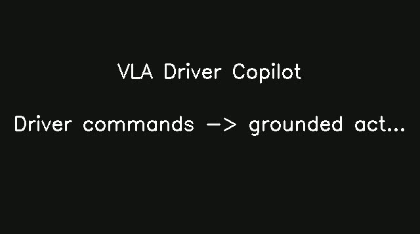

# VLA Driver Copilot

A Vision-Language-**Action** system that grounds natural-language driver
commands ("park behind the white van") to a structured, executable driving
decision -- not just a description of the scene.


*(placeholder -- generate with `python -m demo.make_demo_video` once clips + API key are in place)*

## Why this is VLA, not just VLM

A plain VLM demo stops at "the model can describe what it sees" or "the
model can answer a question about the image" -- language *about* vision,
nothing more. This project makes language *produce a decision that would
change what the vehicle does*: a driver command goes in, a structured
action comes out (maneuver + grounded target object + rationale), and it's
evaluated as a prediction task against hand-labeled ground truth -- the
same way real motion-prediction research (nuScenes prediction challenge,
Waymo Open Motion Dataset) evaluates planning without needing a live
simulator. The moment language changes a *decision* instead of just
generating text, you've crossed from VLM into VLA.

## Architecture

```
 Driving frame(s) + driver command ("park behind the white van")
              |
              v
   ┌─────────────────────────┐
   │  reasoning/vlm_client.py │   <- the one hosted API call: a VLM decides
   │  (Groq / Claude / GPT)   │      WHAT to do and WHAT object it refers to
   └─────────────────────────┘
              |  target_description="white van...", maneuver="pull_over"
              v
   ┌─────────────────────────┐
   │ perception/grounding.py │   <- GroundingDINO (local, open-vocabulary)
   │      (GroundingDINO)    │      finds WHERE that object is in the frame
   └─────────────────────────┘
              |  box=[x1,y1,x2,y2]
              v
   ┌─────────────────────────┐
   │  perception/depth.py    │   <- local depth model judges near/mid/far
   └─────────────────────────┘      + closing/opening trend across frames
              |
              v
   ┌─────────────────────────┐
   │    viz/overlay.py       │   <- HUD-style overlay + annotated video
   └─────────────────────────┘
```

**Why two stages instead of one big VLM call for everything**: general
VLMs are often unreliable at precise pixel coordinates. `eval/ablation.py`
quantifies this directly -- it compares this two-stage pipeline against
asking the VLM to output the bounding box itself in a single call, so the
design choice is backed by a measured result, not just asserted.

**What's an API call vs. a local model vs. code we wrote**, since that
distinction matters for understanding the actual contribution here:

| Component | What it is | Hosted API? |
|---|---|---|
| VLM reasoning (intent + maneuver decision) | Groq/Claude/GPT | Yes -- the one API call |
| Grounding (GroundingDINO) | Local pretrained model | No |
| Depth estimation | Local pretrained model (Depth-Anything-V2) | No |
| Tracking, overlay, evaluation harness, ablation | Code in this repo | N/A -- this is the actual system design |

## Evaluated open-loop, on purpose

There's no live vehicle or simulator here -- clips are real, pre-recorded
footage, so the system can't literally execute an action on them. What it
produces instead is a *prediction* of the correct action at each point in
the clip, scored against hand-labeled ground truth. This is standard
practice in AV motion-prediction/planning research, not a workaround --
see `report/writeup.md` for more on this and on what closed-loop control
would take as future work.

## Setup

```bash
pip install -r requirements.txt
cp .env.example .env   # fill in GROQ_API_KEY (or switch VLM_BACKEND)
```

See `data/README.md` for how to get driving clips in place.

## Usage

```bash
# Run the pipeline on one clip + command, save an annotated video
python scripts/run_example.py --clip data/clips/example_01 --command "park behind the white van"

# Score against the hand-labeled eval set
python -m eval.run_eval

# Run the two-stage vs. single-stage ablation
python -m eval.ablation

# Generate the full demo reel
python -m demo.make_demo_video
```

## Results

See `report/writeup.md` for the full write-up, results table, and failure
analysis once real labeled data is in place.

## Project structure

```
reasoning/    VLM reasoning client (the one hosted API call)
perception/   Grounding (GroundingDINO) + depth estimation (local models)
pipeline/     Orchestration: single-frame decision + multi-frame tracking
viz/          HUD overlay + video rendering
eval/         Hand-labeled test set, scoring, and the two-stage ablation
demo/         Assembles the final demo reel
data/         Clip sourcing instructions (gitignored raw data)
scripts/      CLI entry points
report/       Write-up
```
