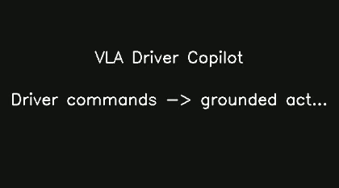

# VLA Driver Copilot

A Vision-Language-Action system that grounds natural-language driver
commands ("park behind the white van") to a structured, executable driving
decision -- not just a description of the scene.




## Setup

```bash
pip install -r requirements.txt
cp .env.example .env   # fill in GROQ_API_KEY (or switch VLM_BACKEND)
```

## Usage

```bash
python scripts/run_example.py --clip data/clips/scene-0061 --command "follow the white van ahead" --fps 2

# Score against the hand-labeled eval set
python -m eval.run_eval

# Run the two-stage vs. single-stage ablation
python -m eval.ablation

# Generate the demo reel (real nuScenes footage + a running driver Q&A)
python -m demo.make_demo_video

# Interactive live UI
python -m webapp.app
# then open http://127.0.0.1:5000
```


```
